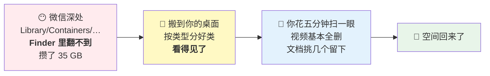
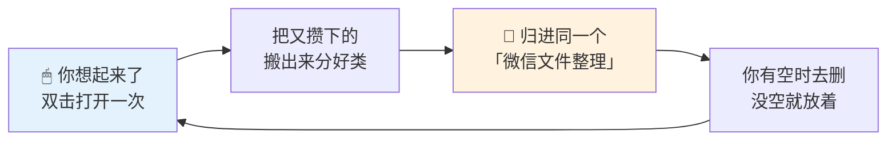

# 👂 小耳微信清扫器

<p align="center">
  <a href="https://github.com/Jane-xiaoer/xiaoer-wechat-sweeper/releases/latest">
    
  </a>
  <a href="#windows-怎么用">
    
  </a>
</p>

<p align="center">
  <a href="https://github.com/Jane-xiaoer/xiaoer-wechat-sweeper/releases/latest"></a>
  
  
  
  <a href="LICENSE"></a>
</p>

各个群里发的文件，微信默默存在你电脑上，你根本找不到在哪。

小耳微信清扫器帮你翻出来 —— 电脑里已有的、自己重复的，先剔掉；剩下的分好类。

你花五分钟挑一遍：有用的留下，没用的删掉。资料沉淀了，内存也清了。

```
微信占用：154 GB  →  19 GB
```

> **v2.2.0 水彩宣纸版**：全新粉绿水彩界面、繁体排版、毛笔滑杆与墨色切换动效；
> 应用图标同步换成水彩耳朵与红扫帚。

<p align="center">
  
  
</p>

<p align="center"><sub>左：一打开就告诉你占了多少　·　右：拖毛笔滑杆决定留多久（图中数字为示意）</sub></p>

---

## 怎么用

### macOS

1. 从 [Releases](https://github.com/Jane-xiaoer/xiaoer-wechat-sweeper/releases/latest)
   下载最新版 `小耳微信清扫器.zip`，解压
2. 双击 `小耳微信清扫器.app`
3. 浏览器自动弹出面板，跟着五步走完 —— **全程不用碰终端**

> ✅ **已通过 Apple 公证**（Developer ID + Notarization），下载后直接双击即可，
> 不会出现「无法验证开发者」的警告。

<h3 id="windows-怎么用">Windows</h3>

Windows 版**暂时没有打包成 exe**，用源码跑，一样是双击：

1. 点仓库右上角绿色 `Code` → `Download ZIP`，解压
2. 确认装了 [Python](https://www.python.org/downloads/)（安装时勾上 **Add Python to PATH**）
3. 双击 `小耳微信清扫器.bat`，浏览器会自动弹出同一个面板

> Windows 上微信的数据目录可以被搬到任意盘，工具会自己去
> `%APPDATA%\Tencent\xwechat\config` 里读微信记录的真实位置，不用你手动找。
> 新版（`xwechat_files`）和旧版（`WeChat Files`）两种布局都支持。

---

## 它做什么

1. **自动找到微信目录** —— 支持一台电脑登录过多个微信号
2. **扫描并报告** —— 哪个月占了多少、多少个文件，看清楚再动手
3. **问你两件事** —— 保留最近几个月？搬到哪里？（面板默认留 1 个月）
4. **搬走并分类** —— 按 📄文档 / 🎬视频 / 🖼图片 / 📊表格 / 📽演示 / 📦压缩包 分好
5. **下次还归到同一个地方** —— 目标文件夹默认固定，第二次搬的并进同一套分类夹，同名不覆盖

## 它不做什么

| | 为什么 |
|---|---|
| ❌ 不删除任何文件 | 只移动。删不删由你决定 |
| ❌ 不碰聊天图片（`attach`） | 删了翻记录会大面积变灰，风险高 |
| ❌ 不碰聊天数据库（`db_storage`） | **那是聊天记录本体，动了会真丢数据** |
| ❌ 不碰 `Backup/` | 那是你主动做的"聊天记录备份"，可能是你唯一的备份 |
| ❌ 不上传任何东西 | 全程本地运行，没有联网代码 |

---

## 长期怎么用：想起来就打开一次

**没有定时任务，不常驻后台，不开机自启** —— 它只在你双击的那一次跑，跑完就退出。

觉得电脑又满了，就再打开一次，还是那三步：你点开 → 你选保留几个月 → 你确认搬运。

好处是第二次、第三次不用重新做决定：

- **目标文件夹默认固定**（桌面的「微信文件整理」），所以每次清都归到同一个地方
- **第二次搬的并进同一套分类夹** —— 不会每清一次就多一个日期文件夹，越攒越乱
- 面板顶部会显示 **上次清扫的日期和累计次数**，你一眼知道上回是什么时候

目标文件夹长这样：

```
微信文件整理/
├── 🎬 视频/
├── 📄 文档/
│   ├── 📊 报告与白皮书/
│   ├── 📋 合同与表单/
│   ├── 🎓 课件与教程/
│   ├── 💼 简历/   📚 书籍/
│   └── 📎 其他文档/
├── _重复_电脑里已有/      ← 查重筛出来的，只是挪到这儿，没删
└── 我的分类.txt           ← 想按自己关心的话题分，就编辑它
```

**两条规则解决"新旧混在一起"的问题：**

1. **同名不覆盖** —— 第二次搬进来的同名文件会变成 `xxx_1.pdf`，你上次特意留下的那份不会被冲掉
2. **按时间排序就能分新旧** —— 搬运保留文件原始时间（= 你当初在群里收到它的时间）

## 🔴 删完发现空间没释放？

**这是最常见的困惑，而且原因几乎没人知道。**

**macOS**：Time Machine **本地快照**会攥着你删掉的文件不放 —— 快照记录的是"删除之前"的磁盘状态，所以在它眼里那些文件还活着，空间自然不还给你。

**Windows**：按可能性从高到低查 —— 回收站没清空 / 目标文件夹和微信数据在同一个盘（搬运不改变总占用）/ 系统还原点占着地方。

实测案例：

| 删了 | 实际回血 | 差额去哪了 |
|---|---|---|
| 35 GB 微信文件 | 29 GB | 被快照锁住 |
| 17 GB 虚拟机 | **5.7 GB** | 被快照锁住 |
| — | — | 某台机器上快照一个人锁了 **620 GB** |

**不用你自己查** —— 面板跑完那一页会直接列出这台机器上的快照，
告诉你有几个、怎么删。

> 删本地快照的唯一代价：失去"从本地快照恢复误删文件"这个后悔药。
> **外接硬盘上的 Time Machine 备份不受影响**，系统之后也会自己重建新快照。


---

## 原理：一句话

**微信把文件藏在你永远看不见的地方，所以你永远不会去删它们。**
这个工具就是把它们搬到你看得见的地方，剩下的你自己决定。



## 一步一步会发生什么

下面是从你双击到空间真正回来的完整过程 ——
**前 5 步在面板里点着走完，后 2 步在你自己手上。**

---

**第 1 步 · 找 🔍**
自动找到微信的存储目录（每台电脑的路径都不同，工具自己找，也支持你登过好几个微信号）。
**这一步不碰任何文件。**

**第 2 步 · 报告 📊**
告诉你实情：

```
🎬 视频   共 23.0GB，13 个月份
    2025-11    3.9GB   213 个文件
    2026-07    3.8GB   198 个文件
    …
📄 文件   共 12.0GB，13 个月份

💾 合计占用：35.0GB
```

**第 3 步 · 问你两件事 ❓**
- 保留最近几个月不动？（默认 1 个月）
- 搬到哪个文件夹？（可以回车用默认、粘贴路径、或者弹系统选择框自己挑）

**第 4 步 · 预演 👀**
把"将要搬走什么"先列给你看。**这时候还没动手**，你说取消就取消，一个文件都不会动。

**第 5 步 · 搬 🚚**
确认之后才真正移动。**是移动不是拷贝** —— 同一块硬盘上改指针，瞬间完成，
微信那边的旧月份文件夹直接清空。

搬完长这样：

```
微信文件整理/
├── 🎬 视频/            213 个
├── 📄 文档/
│   ├── 📊 报告与白皮书/  127 个
│   ├── 🎓 课件与教程/     34 个
│   └── 📎 其他文档/       19 个
└── _重复_电脑里已有/    15 个（查重筛出来的，没删）
```

**第 6 步 · 你自己删 👤**
工具到这里就结束了，**它不会替你删任何东西**。你打开文件夹扫一眼：
视频基本可以全删，文档挑几个想留的移走，剩下的按分类夹整个删掉。

**第 7 步 · 空间回来了 💾**

---

### ⚠️ 三个地方最容易误解

**① 搬完的那一刻，可用空间是不变的**

文件还在，只是换了个位置。**真正的释放发生在第 6 步你按下删除时。**
不知道这点的人会以为"整理完空间没变，这工具是骗人的"。

**② 删完还是没释放？那是 macOS 的锅**

Time Machine **本地快照**会攥着已删文件不放。实测：删 35GB 只回血 29GB、
删 17GB 只回血 5.7GB、某台机器上快照一个人锁了 **620GB**。
面板跑完那一页会直接告诉你。

**③ 删了不会丢聊天记录**

聊天记录的文字**一条都不会少**。只是以后在微信里点那个文件，会提示
"已过期或已被清理" —— 而这些文件在腾讯服务器上通常也早就过期，本来就点不开。

---

## 第二次、第三次清的时候



**第二次清扫并进同一套分类夹**，不会每清一次就多一个日期文件夹 —— 否则三次不整理
就躺着三个文件夹，越攒越乱。**同名文件不会覆盖**，第二次搬进来的会变成 `xxx_1.pdf`，
你上次特意留下的那份还在；搬运保留文件原始时间，**按时间排序就知道哪些是新的**。


---

## 🔁 搬之前先查重（v1.1 新增）

**微信里很多文件，你电脑上早就有了。**

群里转发的东西，很多本来就是你自己发出去的，或者你早就存过一份 —— 微信不认识它们是同一份，
于是你的硬盘上躺着两份。

工具在搬运前会先建一份本机索引（默认扫 桌面 / 文稿 / 下载），然后比对：

| 判定 | 依据 |
|---|---|
| 🔁 **本机已有** | 文件名 + 字节数完全相同 |
| 🔁 **群发重复** | `小耳简历.pdf` 和 `小耳简历(1).pdf` 是同一份，多个群转发下载了两次 |
| ❓ **只报告不判定** | 内容一致但文件名完全不同 —— 这种不敢替你决定，照常分类 |

**重复的不删除**，单独归到 `_重复_电脑里已有/`，你过目后自己处置。

真实一轮实测（某用户三个月的量）：

```
本机索引 50,576 个文件 · 2 秒建好
微信待比对 288 个 → 剔出 15 个重复

相机博物馆-操作指南-A4(1).svg    ← 自己做的展览物料，桌面上就有原件
零与非零：AI影像时代的哲学思辨.docx ← 自己写的文章
26年8月发.zip                    ← 自己公司的银行流水
```

不想查重的话，面板第 3 步有个「先查重」的勾，取消掉就行。


---

## 常见问题

**Q：删掉这些文件，聊天记录会不会没了？**

不会。**聊天记录的文字一条都不会少。** 文件和聊天记录是分开存的，删掉文件后，
在微信里点那条消息会提示"文件已过期或已被清理"，仅此而已。

而且这些文件在腾讯服务器上通常保存几天就过期了 —— **就算你不删，很多也早就点不开了。**

**Q：手机重新登录电脑微信，会不会又同步回来？**

不会。微信是**按需下载**的，你不点那个文件它就不会下载。真正会一次性灌进几十 GB 的，
只有你主动在手机上点「聊天记录迁移与备份 → 备份到电脑」。**建议以后别用那个功能**，
要备份就传网盘。

**Q：为什么不直接删，还要搬出来？**

因为你可能有想留的。搬出来分好类，你花五分钟扫一眼，视频基本可以全删，
文档挑几个留下 —— 比让工具替你猜靠谱得多。

**Q：安全吗？**

- 主体代码在 `wechat_cleaner.py` 一个文件里，**不到 800 行，你可以自己看完**
- **零第三方依赖**，只用 Python 标准库（macOS 自带 python3；Windows 需自己装 Python）
- 没有任何联网代码
- 默认预演模式，让你看清楚要搬什么，确认了才动手

---

## 它到底清了什么（真实案例）

2026 年 8 月，一位用户的微信占了 **154 GB**：

| 组成 | 大小 | 是什么 |
|---|---|---|
| 聊天记录备份 ×2 | **98 GB** | 用户 2024-12 和 2025-08 各点了一次"备份到电脑"，**早就忘了** |
| 聊天视频 | 23 GB | 群里转发的各种视频 |
| 聊天文件 | 12 GB | 收到的 PDF、文档 |
| 聊天图片 | 11 GB | （本工具不碰） |

**最大的一块是"备份聊天记录到电脑"生成的，而用户完全不记得做过这件事。**
这个工具会在扫描时提醒你检查 `Backup/` 目录，但不会自动处理它 —— 那可能是你唯一的备份。

---

## 系统要求

- macOS（用了 `launchctl`、`osascript` 等系统能力）
- Python 3（**macOS 自带**，不用另外装）
- 微信 Mac 版

## License

MIT — 随便用、随便改、随便分发。

由 [小耳](https://github.com/) 用 Claude Code 做成。
