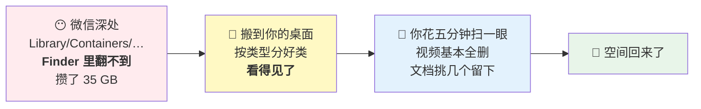

# 🧹 微信存储清理器

**你的 Mac 上，微信可能正悄悄占着几十 GB。**

微信会把聊天里收到的**文件和视频**永久存在电脑上，按月份堆着，**从不自动清理**。
它们藏在系统的深层目录里，Finder 里根本翻不到。

这个工具帮你找出来、搬出来、分好类。**至于删不删，你自己决定 —— 它只移动，绝不删除。**

```
清理前：微信占 154 GB
清理后：微信占  19 GB
```

（真实案例，见下方「它到底清了什么」）

---

## 怎么用

### 方式一：双击运行（推荐给大多数人）

1. 下载这个仓库（绿色 `Code` 按钮 → `Download ZIP`），解压
2. **右键点击** `清理微信存储.command` → 选「**打开**」
3. 跟着提示走就行

> ⚠️ **第一次必须用右键 →「打开」，不能直接双击。**
> macOS 对从网上下载的脚本有安全拦截，会说"无法验证开发者"。
> 右键打开一次并确认后，以后就可以直接双击了。这是 macOS 的通用机制，
> 任何未经苹果签名的工具都一样。

### 方式二：交给你的 AI 助手

如果你在用 Claude Code、Cursor 或其他 AI 编程助手，直接把这个文件夹给它，说：

> 帮我用这个工具清理一下微信占的空间

它会读 [`AGENTS.md`](AGENTS.md)，先扫描给你看清楚，问你想放哪，再动手。

### 方式三：命令行

```bash
python3 wechat_cleaner.py            # 交互式问答
python3 wechat_cleaner.py --json     # 只扫描，输出 JSON，不碰任何文件
python3 wechat_cleaner.py --help     # 全部参数
```

---

## 它做什么

1. **自动找到微信目录** —— 支持一台电脑登录过多个微信号
2. **扫描并报告** —— 哪个月占了多少、多少个文件，看清楚再动手
3. **问你两件事** —— 搬到哪里？保留最近几个月？（默认 3 个月）
4. **搬走并分类** —— 按 📄文档 / 🎬视频 / 🖼图片 / 📊表格 / 📽演示 / 📦压缩包 分好
5. **可选：定期自动跑** —— 装个定时任务，每 3 个月自动整理一次，完了在「提醒事项」提醒你

## 它不做什么

| | 为什么 |
|---|---|
| ❌ 不删除任何文件 | 只移动。删不删由你决定 |
| ❌ 不碰聊天图片（`attach`） | 删了翻记录会大面积变灰，风险高 |
| ❌ 不碰聊天数据库（`db_storage`） | **那是聊天记录本体，动了会真丢数据** |
| ❌ 不碰 `Backup/` | 那是你主动做的"聊天记录备份"，可能是你唯一的备份 |
| ❌ 不上传任何东西 | 全程本地运行，没有联网代码 |

---

## 长期怎么用：装一次，以后自动

第一次跑完，工具会问你要不要装定期任务。装了之后：

- **每 3 个月自动运行一次**（间隔可改），把又攒够 3 个月的文件搬出来
- 搬完在 macOS「**提醒事项**」里建一条待办，不是弹一下就消失的通知
- 你有空的时候去处理，没空就放着

目标文件夹长这样：

```
微信文件整理/
├── ⚠️ 待清理_20260814/          ← 第一批
│   ├── 微信文件_2025年5月-2026年5月/
│   │   ├── 📄 文档/  📊 表格/  📽 演示/
│   └── 微信视频_2025年5月-2026年5月/
│       └── 🎬 视频/
├── ⚠️ 待清理_20261114/          ← 三个月后自动搬出来的第二批
└── ✅ 我要留的/                  ← 你自己拖进来的，工具永不触碰
```

**三条规则解决"新旧混在一起"的问题：**

1. **每批自成一个文件夹**，按日期命名 —— 上批没清完的不会跟新一批混
2. **`✅ 我要留的` 是你的地盘** —— 工具只读不写，永远不会覆盖或移动里面的东西
3. **清完一批就整个删掉** 那个 `⚠️ 待清理_日期` 文件夹，干净利落

## 🔴 删完发现空间没释放？

**这是最常见的困惑，而且原因几乎没人知道。**

macOS 的 Time Machine **本地快照**会攥着你删掉的文件不放 —— 快照记录的是"删除之前"的磁盘状态，所以在它眼里那些文件还活着，空间自然不还给你。

实测案例：

| 删了 | 实际回血 | 差额去哪了 |
|---|---|---|
| 35 GB 微信文件 | 29 GB | 被快照锁住 |
| 17 GB 虚拟机 | **5.7 GB** | 被快照锁住 |
| — | — | 某台机器上快照一个人锁了 **620 GB** |

**一条命令诊断：**

```bash
python3 wechat_cleaner.py --check-space
```

它会告诉你有几个快照、怎么删、以及要不要关掉自动生成。

> 删本地快照的唯一代价：失去"从本地快照恢复误删文件"这个后悔药。
> **外接硬盘上的 Time Machine 备份不受影响**，系统之后也会自己重建新快照。


---

## 原理：一句话

**微信把文件藏在你永远看不见的地方，所以你永远不会去删它们。**
这个工具就是把它们搬到你看得见的地方，剩下的你自己决定。



## 一步一步会发生什么

### 起点：两种用法，选一个

| | 怎么做 | 适合谁 |
|---|---|---|
| **双击** | 右键 `清理微信存储.command` →「打开」 | 大多数人 |
| **交给 AI** | 把文件夹丢给 Claude Code / Cursor，说「帮我清理微信空间」 | 手边有 AI 助手的 |

**两条路后面的步骤完全一样**，区别只是"谁在跟你说话" —— 终端，还是你的 AI 助手。

---

**第 1 步 · 找 🔍**
自动找到微信的存储目录（每台电脑的路径都不同，工具自己找，也支持你登过好几个微信号）。
**这一步不碰任何文件。**

**第 2 步 · 报告 📊**
告诉你实情：

```
🎬 视频   共 23.0GB，13 个月份
    2025-11    3.9GB   213 个文件
    2026-07    3.8GB   198 个文件
    …
📄 文件   共 12.0GB，13 个月份

💾 合计占用：35.0GB
```

**第 3 步 · 问你两件事 ❓**
- 保留最近几个月不动？（默认 3 个月）
- 搬到哪个文件夹？（可以回车用默认、粘贴路径、或者弹 Finder 自己挑）

**第 4 步 · 预演 👀**
把"将要搬走什么"先列给你看。**这时候还没动手**，你说取消就取消，一个文件都不会动。

**第 5 步 · 搬 🚚**
确认之后才真正移动。**是移动不是拷贝** —— 同一块硬盘上改指针，瞬间完成，
微信那边的旧月份文件夹直接清空。

搬完长这样：

```
微信文件整理/
└── ⚠️ 待清理_20260814/
    ├── 微信文件_2025年5月-2026年5月/
    │   ├── 📄 文档/     127 个
    │   ├── 📊 表格/      34 个
    │   └── 📽 演示/      19 个
    └── 微信视频_2025年5月-2026年5月/
        └── 🎬 视频/     213 个
```

**第 6 步 · 你自己删 👤**
工具到这里就结束了，**它不会替你删任何东西**。你打开文件夹扫一眼：
视频基本可以全删，文档挑几个想留的拖进 `✅ 我要留的`，剩下的整个文件夹删掉。

**第 7 步 · 空间回来了 💾**

---

### ⚠️ 三个地方最容易误解

**① 搬完的那一刻，可用空间是不变的**

文件还在，只是换了个位置。**真正的释放发生在第 6 步你按下删除时。**
不知道这点的人会以为"整理完空间没变，这工具是骗人的"。

**② 删完还是没释放？那是 macOS 的锅**

Time Machine **本地快照**会攥着已删文件不放。实测：删 35GB 只回血 29GB、
删 17GB 只回血 5.7GB、某台机器上快照一个人锁了 **620GB**。
跑一句 `python3 wechat_cleaner.py --check-space` 就知道了。

**③ 删了不会丢聊天记录**

聊天记录的文字**一条都不会少**。只是以后在微信里点那个文件，会提示
"已过期或已被清理" —— 而这些文件在腾讯服务器上通常也早就过期，本来就点不开。

---

## 装了定时任务之后


**每批自成一个文件夹**（`⚠️ 待清理_20260814/`、`⚠️ 待清理_20261114/`…），
新的一批不会跟上批混在一起 —— 否则你分不清哪些是上次没清完的，
**同名文件还会把你上次特意留下的那份冲掉**。

而 `✅ 我要留的/` 是你的地盘，**工具只读不写，永远不会动里面的东西**。


---

## 常见问题

**Q：删掉这些文件，聊天记录会不会没了？**

不会。**聊天记录的文字一条都不会少。** 文件和聊天记录是分开存的，删掉文件后，
在微信里点那条消息会提示"文件已过期或已被清理"，仅此而已。

而且这些文件在腾讯服务器上通常保存几天就过期了 —— **就算你不删，很多也早就点不开了。**

**Q：手机重新登录电脑微信，会不会又同步回来？**

不会。微信是**按需下载**的，你不点那个文件它就不会下载。真正会一次性灌进几十 GB 的，
只有你主动在手机上点「聊天记录迁移与备份 → 备份到电脑」。**建议以后别用那个功能**，
要备份就传网盘。

**Q：为什么不直接删，还要搬出来？**

因为你可能有想留的。搬出来分好类，你花五分钟扫一眼，视频基本可以全删，
文档挑几个留下 —— 比让工具替你猜靠谱得多。

**Q：安全吗？**

- 全部代码在 `wechat_cleaner.py` 一个文件里，**700 行左右，你可以自己看完**
- **零第三方依赖**，只用 Python 标准库（macOS 自带 python3）
- 没有任何联网代码
- 默认预演模式，让你看清楚要搬什么，确认了才动手

---

## 它到底清了什么（真实案例）

2026 年 8 月，一位用户的微信占了 **154 GB**：

| 组成 | 大小 | 是什么 |
|---|---|---|
| 聊天记录备份 ×2 | **98 GB** | 用户 2024-12 和 2025-08 各点了一次"备份到电脑"，**早就忘了** |
| 聊天视频 | 23 GB | 群里转发的各种视频 |
| 聊天文件 | 12 GB | 收到的 PDF、文档 |
| 聊天图片 | 11 GB | （本工具不碰） |

**最大的一块是"备份聊天记录到电脑"生成的，而用户完全不记得做过这件事。**
这个工具会在扫描时提醒你检查 `Backup/` 目录，但不会自动处理它 —— 那可能是你唯一的备份。

---

## 系统要求

- macOS（用了 `launchctl`、`osascript` 等系统能力）
- Python 3（**macOS 自带**，不用另外装）
- 微信 Mac 版

## License

MIT — 随便用、随便改、随便分发。

由 [小耳](https://github.com/) 用 Claude Code 做成。
